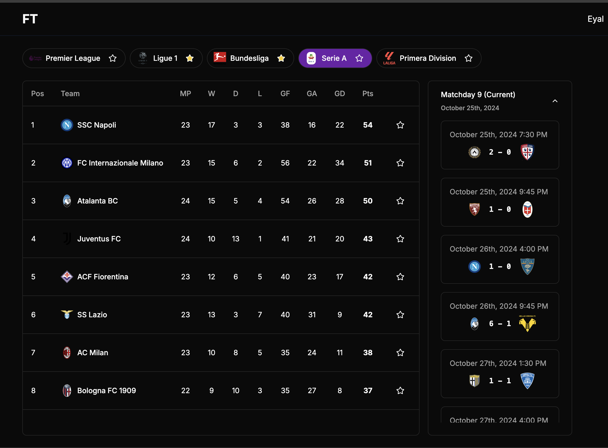

# Football Data Explorer

A modern web application that demonstrates the usage of the [football-data.org](https://www.football-data.org/) API, built with Next.js 14, Shadcn UI, and TanStack Query (React Query).




## Tech Stack

- [Next.js 14](https://nextjs.org/) - React framework for production
- [Shadcn UI](https://ui.shadcn.com/) - Re-usable components built with Radix UI and Tailwind CSS
- [TanStack Query](https://tanstack.com/query/latest) - Powerful data synchronization for React
- [Tailwind CSS](https://tailwindcss.com/) - Utility-first CSS framework
- [football-data.org API](https://www.football-data.org/) - Football data API

## Getting Started


1. Install dependencies:
```bash
pnpm install
```

2. Create a `.env.local` file in the root directory and add your football-data.org API key:
```bash
FOOTBALL_DATA_API_KEY=your_api_key_here
```

3. Run the development server:
```bash
npm run dev
```

4. Open [http://localhost:3000](http://localhost:3000) in your browser.

## API Configuration

To use this application, you'll need to:
1. Sign up for a free API key at [football-data.org](https://www.football-data.org/)
2. Add the API key to your `.env.local` file
3. Review the [API documentation](https://www.football-data.org/documentation/quickstart) for available endpoints

## Contributing

Contributions are welcome! Please feel free to submit a Pull Request.

## Acknowledgments

- Thanks to [football-data.org](https://www.football-data.org/) for providing the API
- [Shadcn UI](https://ui.shadcn.com/) for the beautiful components
- The Next.js team for the amazing framework
